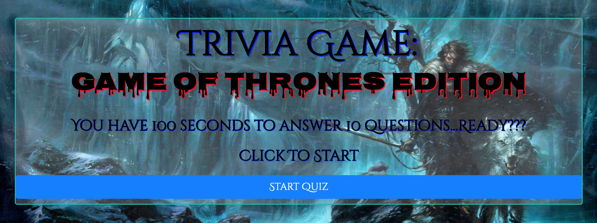

# TriviaGame
Link to page: https://edwardfarris.github.io/TriviaGame/

A Game of Thrones themed quiz game that prompts users to answer multiple choices questions in a given amount of time. The page will then display the results of their performance, specifically how many questions they got correct and how many they got incorrect. I hope to add a feature that tells users which specific questions they got incorrect and also tells them the correct answer for those questions. Players have an average time of 10 seconds per question and there are 10 questions total. Utilized technologies include html5, CSS, and JavaScript. This was an opportunity to code a working javascript timer that counts down from a desired starting point.
